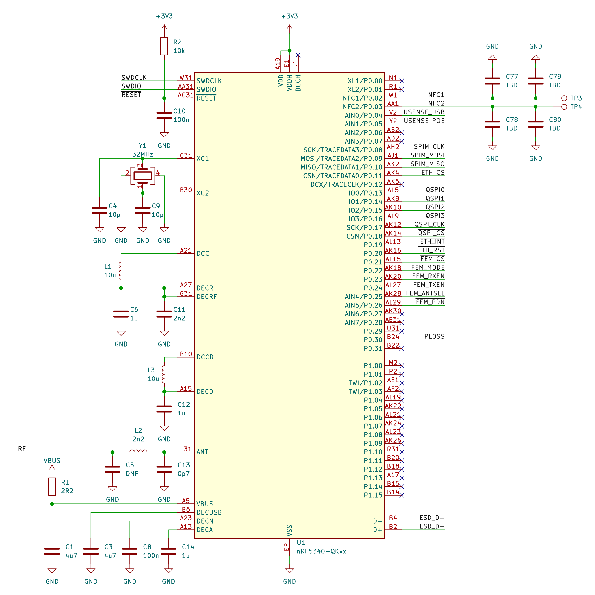

# REPEAT - Smart IoT Gateway

REPEAT is a device based on the nRF5340, intended to serve as an IoT gateway in BLE, Zigbee, Thread or Matter networks.  It fully supports the previously mentioned protocols for wireless communication, for wired link, an 100Mbit ethernet interface, with PoE 802.3 af for power, is implemented. USB C is also used for additional communication and power. 

The device supports Zephyr RTOS. Drivers (for the ethernet interface) and board definition files are provided.

## Hardware

The board is equiped with an nRF5340 as the main SoC with 32Mbit flash memory chip (MX25R3235F) for data storage. nRF21540 is used as an RF frontend. W5100S serves as a 100Mbit ethernet MAC.SI3402 is used for PoE power managment. 

Pin mapping of the MCU can be found bellow. For more information, [the schematic](schematic.pdf) or the [the KiCad project](repeat-hw) is available.

## Programming

### Board definition
### Wiznet W5100S driver

